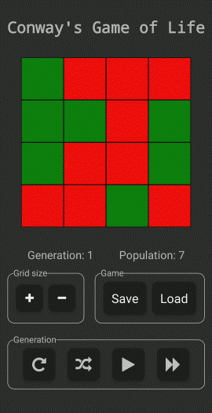

# conway

Implementation of Conway's Game of Life in React Native. Cells can manually be set as dead or alive, the board size can be increased and decreased, as well as reset or shuffled. Saving and loading games is also supported.

## Demo

Get the [APK](https://github.com/POWRFULCOW89/conway/releases/download/v1.0.0/Conway.apk) or get from the [Play Store](https://play.google.com/store/apps/details?id=com.conway)

